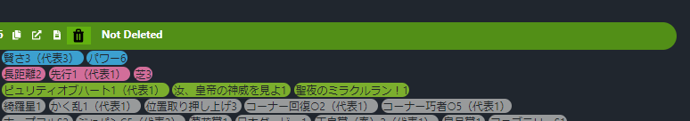
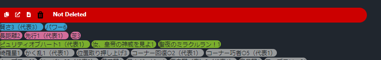

# Chrome extension for umadb
Thsi is an extension meant to be used for umadb, where the user can save the seen trainer ids and factors.

## !
 - I won't be releasing this in chrome web store, mainly because I don't want to spend $5 for this, so yeah, you can only use this by loading it manually.
 - Even when you use this, it will use localStorage for saving the info.
 - There is keybind for the extension (Ctrl+B) which is only removeable by manually removing/editing the "commands" in manifest.json


## Installation

- Clone project

```bash
  git clone https://github.com/laefy13/umadb-data-saver
```

- [load the unpacked extension](https://developer.chrome.com/docs/extensions/get-started/tutorial/hello-world#load-unpacked)


## How to use
 - [yt video](https://youtu.be/S6P5Hgd5-Jw)
 - The color of the header will be default if the user hasn't seen it, and will change to the desired color (default is red) if the user has seen it.
    #### Normal header:
    
    #### Seen header:
    

## Options
- "Save IDs only"
    - On: will save the IDs only, so if there is a change in the factors, the extension won't be able to detect the change
    - Off: will save the ID + factors, but this could take a lot of space, since some users has a lot of factors, I tested this and I used like 80kb for around 50~ Ids with factors, so yeah.
- "One Page"
    - On: the extension will only run once in the current page, and when the user go to the next page, the extension won't apply (user will have to click again the extension for that page).
    - Off: the extension will work even when the user go to the next page
- "Color"
    - Used to change the color of the header
- "Clear localStorage"
    - Clear both factors and IDs
- "Clear data with factors"
    - name
- "Clear data without factors
    - name


## Acknowledgements
 - [Horseshoe icons created by Those Icons - Flaticon](https://www.flaticon.com/free-icons/horseshoe)
